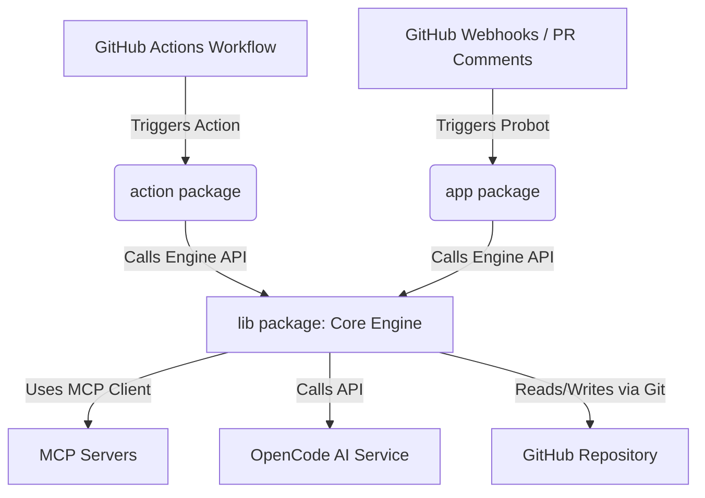
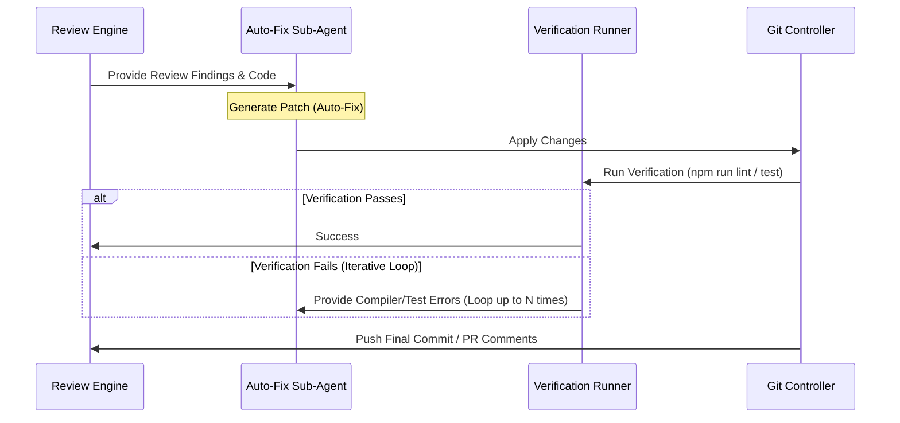

# OpenCode AI Reviewer — Agentic Architecture & Design

This document details the agentic design, core components, and control loops that power the **OpenCode AI Reviewer** (Action and Probot App).

---

## 1. High-Level Architecture

The system is split into three main packages within a pnpm monorepo structure:

- **`lib/` (The Core Engine)**: Contains the orchestration logic, prompt templates, OpenCode API wrapper, JSONL parser, and MCP Client.
- **`action/` (GitHub Action Wrapper)**: Captures input arguments from `action.yml`, prepares context from the runner filesystem, invokes the library engine, and sets outputs/comments.
- **`app/` (GitHub App Probot Server)**: Listens for GitHub webhooks (`pull_request`, `issue_comment`, etc.), parses slash-commands (e.g. `/fix`, `/review`, `/audit`), builds configuration dynamically, and triggers the core engine.

---

## 2. Agent Core Loops

### A. The Review Loop (`review` mode)
1. **Diff Extraction**: The engine retrieves the PR diff from GitHub.
2. **File Batching**: Files are grouped into smaller batches (configured by `batchSize`, default `3`) to fit context windows and improve review quality.
3. **Sub-Agent Review**: For each batch, a prompt is constructed using:
   - System prompt templates.
   - Built-in/custom review guidelines.
   - Project description and specific conventions.
   - Relevant MCP context.
4. **JSONL Parsing**: The AI response is parsed line-by-line as JSON Lines (JSONL). The format parses findings as `summary`, `verdict`, `strength`, or `issue` (with line numbers and file paths).
5. **Verdict Generation**: If `requireVerdict` is enabled, the agent aggregates findings and outputs a final decision (Approved vs Changes Requested) with reasoning.

### B. The Auto-Fix Loop (`fix` mode)
When auto-fix is triggered, the agent executes an iterative correction cycle:

1. **Diagnosis**: Read the `issue` findings from the review step.
2. **Patch Generation**: Request the AI to generate a direct correction for the file.
3. **Verification**: Run `run_checks_after_fix` (e.g., `npm run lint`, `pnpm typecheck`, `npm test`) on the modified code.
4. **Loop / Backtrack**:
   - If verification passes, stage the changes.
   - If verification fails, feed the compile/test errors back to the AI and prompt it to try again (up to `maxIterations`, default `3`).

### C. The Codebase Audit Loop (`audit` mode)
1. **Category Selection**: Read standard categories from `prompts/audit-categories/` (e.g., security, performance, code quality).
2. **Batch Scanning**: Walk the repository directories, extracting file contents up to a maximum lines threshold.
3. **Analysis & Issue Creation**: Generate structural reports for each category. If findings meet the severity threshold, the agent automatically creates GitHub Issues tagged with `audit` and optionally kicks off the Auto-Fix loop on them.

---

## 3. Model Context Protocol (MCP) Integration

To prevent context bloat and retrieve relevant details on-demand, the agent implements an **MCP Client**:
- **Local Servers**: Launches background node/python servers (e.g., semantic grep, file indexer, symbol resolver).
- **Remote Servers**: Connects to secure HTTP/WebSocket endpoints to enrich context.
- **Dynamic Retrieval**: Before prompting the model for a review or fix, the agent queries the MCP servers for definition locations, usage references, and lint outputs.

---

## 4. Prompt Engineering Structure

All prompts are constructed programmatically in the `PromptBuilder`:
- **System Prompt**: Sets the persona, behavior rules, and output schema (requiring JSONL format).
- **Context Injection**:
  - **PR Context**: Title, description, commits, changed files, and inline conversation threads.
  - **Project Context**: Project name, description, and coding conventions loaded from `.opencode-reviewer.yml` or `AGENTS.md`.
  - **MCP Context**: Dynamic symbol lookups and file structures.
- **Few-Shot Examples**: Guides the model to output syntactically valid JSONL without markdown fences around JSON lines.
